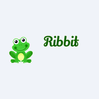
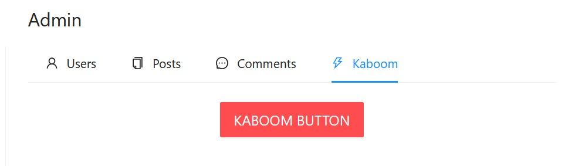

# Ribbit Social Network

> The bird says tweet, tweet, tweet 
> The frog says ribbit, ribbit, ribbit

## Ejercicio - Red Social
Último proyecto individual para el Bootcamp "Full Stack Developer MERN" en The Bridge - Digital Talent Accelerator.

### Requisitos del ejercicio
* Registro de usuarios.
* Login de usuarios.
* Que se puedan ver las publicaciones y crear nuevas.
* Que se puedan editar y eliminar las publicaciones que hace el usuario logueado
* Dar/quitar Like a post.
* Buscador de perfiles de usuario o de posts
* Que en tu perfil puedas ver tus datos y tus posts
* Que puedas comentar en las publicaciones
* Uso de ramas con git, cuando se termine el proyecto deberán quedar dos ramas la main y la develop.
* Presentación de README
* React Router
* Utilizar Redux
* Uso de SASS
* Importante el diseño
* Los componentes no podrán sobrepasar las 400 líneas de código.
* Las funciones no deberán sobrepasar las 75 líneas de código.

#### Extras
* Frontend disponible en producción (ej: Heroku).
* El usuario puede seguir a otros usuarios y tener seguidores
* CRUD de los comentarios
* Que solo puedas editar y eliminar los comentarios que tú creas.
* El usuario puede subir fotos en los posts y cambiar su foto de perfil.
* El usuario puede dar likes a los comentarios de los posts.
* El usuario en su perfil puede ver el número de seguidores y número de a cuántos sigue
* El usuario puede ver quién le sigue y a quién sigue
* Implementación de guards
* Que sea responsive

## Tecnologías y lenguajes utilizados
### Frontend
* HTML / CSS / JavaScript / JSON
* NodeJS
* react
* antd
* axios
* react
* react-dom
* react-infinite-scroll-component
* react-redux
* react-router-dom
* react-string-replace
* sass

### Backend
La API se encuentra en https://github.com/xavi-mat/boot511-back-social
* JavaScript
* Nodejs
* express
* MongoDB
* Mongoose
* multer
* bcryptjs
* jsonwebtoken
* nodemailer
* Atlas

## Estructura
El conjunto de la web es *responsive*. En el ancho máximo consiste en tres columnas.
* Columna izquierda: el menú principal, con iconos y texto de las opciones.
* Columna central: el contenido de la página requerida.
* Columna derecha: el buscador; los cuatro *posts* con más *likes*; el pie.

En **anchuras medias**, el menú izquierdo muestra solo los iconos y esconde el texto.

En **anchuras pequeñas**, desaparecen las dos columnas laterales y se muestra el logotipo Ribbit que da acceso al menú en forma de lateral deslizable (*drawer*). El buscador aparece entonces en la parte superior de la página.

En **anchuras muy pequeñas** (por debajo de 400px), desaparecen los botones de *limpiar formulario* para evitar que se solapen con los demás botones.

### Menú principal
* Los usuarios **no logueados** tienen las siguientes opciones: Inicio, Login, Registro.
* Los usuarios **logueados** pueden acceder a Inicio, Perfil, Usuarios seguidos, Seguidores, Logout.
* El usuario **administrador** accede, además, a la sección de administración.

## Secciones

### Registro `/register`

El habitual formulario de registro: Nombre de usuario, email, contraseña y confirmación de contraseña, *checkbox* para aceptar los términos y condiciones y los botones de enviar y de limpiar formulario.

Los campos están validados e informan al usuario de posibles errores.

Debajo del formulario es visible el logo y el texto de relleno de los términos y condiciones.

### Login `/login`

Formulario de acceso con email y contraseña, validación con mensajes informativos y los botones de enviar y de limpiar.

### Home `/`

En la sección de inicio los usuarios logueados ven el formulario para añadir un *post* **en la parte superior**; los usuarios no logueados, en cambio, ven los botones Login y Registro.

El cuerpo principal de la página lo ocupan diez *posts* con el avatar y el nombre del autor/a, que son enlaces que llevan a al vista de ese usuario/a, el texto del *post*, la imagen opcional de ese post, la fecha de creación del *post* (adaptada al idioma del navegador) y, en el pie, el número de comentarios y *likes* del post. El post entero es clicable y lleva a la vista de post.

Arriba y abajo de la sección de los diez *posts* son visibles las barras de paginación, con los botones para desplazarse entre las distintas páginas, que realizan llamadas a la API y reciben los diez posts correspondientes de la página solicitada.

### Vista de *Post* `/post/<POST_ID>`

La vista de *post* muestra el avatar y el nombre del autor/a, el texto, la imagen opcional y otros datos como el número de comentarios y de *likes*. Aparece, además, la fecha y hora de creación del *post* adaptada al idioma del navegador.

Los usuarios logueados ven también un botón para dar/quitar like al *post*.

Debajo del *post* se encuentra la sección de comentarios. En primer lugar, los usuarios logueados ven un formulario para añadir un comentario, con la posibilidad de añadir imágenes. A continuación la vista de los comentarios, igual a la del post (avatar y nombre del autor/a, texto, imagen, número de likes, fecha y hora).

En esta sección se cargan inicialmente diez comentarios. Al hacer scroll hacia abajo se dispara automáticamente la petición a la API de diez comentarios más, creando un **scroll infinito**, mientras queden comentarios que cargar.

Los usuarios logueados ven, en el post y en los comentarios, los botones de Borrar y de Editar. El botón de Editar abre un formulario en una ventana modal en la que es posible cambiar el texto del propio *post*/comentario.

### Vista de usuario `/user/<USER_ID>`

La vista de usuario muestra el avatar y el nombre de usuario en tamaño más grande.
Debajo del avatar, los usuarios/as logueados encuentran un botón: Seguir/Dejar de seguir, o bien Cambiar Avatar, si están mirando su propio perfil. La opción de *Dejar de seguir* incluye un *Popconfirm*.

A continuación se muestra la información pública del usuario: número de usuarios a los que sigue, de seguidores, de posts, de comentarios, rol y fecha de registro (la fecha está adaptada a la lengua del navegador).

Debajo de la caja de información, sigue el espacio de los *posts* del usuario en un formato más reducido a como aparecen en la página de inicio o en la vista de *post*. Con la imagen, si la hay, a la izquierda y los demás datos a la derecha (fecha adaptada al idioma, texto, número de likes y de comentarios).

Los posts están paginados de diez en diez, como en la página de inicio. Cada *post* es en sí mismo un botón que lleva a la vista en detalle de ese *post*, sus comentarios y el formulario para añadir un comentario.

### Vistas de Usuarios seguidos y de Seguidores `/following`, `/followers`

Ambas vistas tienen el mismo formato. Presentan la información mínima del usuario/a seguido o seguidor: El avatar, el nombre de usuario y la última fecha en la que hubo algún cambio en su perfil.

Cada cuadro es un botón que lleva a la vista de ese usuario.

### Vista de búsqueda `/search/<TEXTO BUSCADO>`

Existe una barra de búsqueda de posts por texto. Está situada en la parte superior de la columna derecha, cuando esta es visible en pantallas anchas, o bien en la parte superior de la columna única en pantallas de menor anchura.

Los resultados de la búsqueda aparecen en el cuerpo central de la página en forma de scroll infinito, cargando 10 posts más en cada llamada a la API. El número total de *posts* encontrados que cumple los requisitos de la búsqueda aparece en la parte superior de la página, bajo el título.

### Vista de Administrador `/admin`

La vista de administrador incluye un submenú horizontal con cuatro opciones: usuarios, *posts*, comentarios y *kaboom*.

#### Usuarios
El administrador/a puede ver, además de los datos públicos, la *id*, el email y las fechas de creación y actualización de cada usuario/a. También puede *Activar/Desactivar* a los usuarios. Los usuarios "desactivados" no pueden escribir nuevos *posts* ni comentarios, pero sí actualizar o borrar sus mensajes anteriores.

El listado de usuarios utiliza también el Scroll Infinito, cargando 10 usuarios más desde la API cada vez que se desliza hasta el final de la página.

#### *Posts* y Comentarios

*Posts* y comentarios presentan su información (autor, texto, imagen, fechas, likes, etc.). Pueden ser también activados/desactivados por el personal de administración.

#### Kaboom

El último elemento del menú del administrador da acceso al *Botón Kaboom*.

Al tratarse de una aplicación de pruebas, existe la opción para borrar todos los usuarios, *posts* y comentarios y rellenar las colecciones con datos generados por *faker*, (avatares y nombres para los usuarios/as, y textos e imágenes para los *posts* y comentarios).

### Términos y condiciones `/terms`
Texto de relleno (*Lorem ipsum*) en el que situar los términos y condiciones de uso de la web, las políticas de privacidad y de cookies.

## Funcionalidades

#### Popconfirm
Se utiliza un **PopConfirm** antes de hacer logout, de dejar de seguir a un usuario, de borrar un *post* o comentario, y también (para el adminitrador), antes de borrar toda la base de datos. El *Popconfirm* presenta un cuadro de confirmación extra al hacer clic en un botón para evitar acciones indeseadas.

#### Escritura

La **escritura** de *posts* y comentarios se realiza en los formularios *Nuevo post*, *Nuevo comentario* o *Editar post o comentario*. El usuario/a escribe e una *textarea* con un límite máximo de 280 caracteres, y puede previsualizar el resultado en un cuadro inferior. El texto admite **negrita**, *cursiva* y **@mencionar** a otros usuarios.

* **Negrita** y *cursiva* en los formularios de escritura. Al escribir una palabra entre \*\***dobles asteriscos**\*\*, será visible como negrita; igualmente, será cursiva si está \_\_*entre dobles barras bajas*\_\_.

* **@Menciones** en los formularios de escritura. Al escribir el símbolo **@**, y algunas letras, se lanza una llamada a la API con una búsqueda de usuarios por nombre. A cada tecla pulsada se realiza de nuevo la búsqueda. Es posible seleccionar un usuario/a de la lista; en el *textarea* aparecerá en texto plano con su *id* interna entre los símbolos < >, pero será visible como un enlace en negrita que lleva a la vista de ese usuario. El cuadro de previsualización, muestra cómo quedará al final el mensaje.

#### **Skeletons**.
En gran parte de las pantallas, mientras se realiza una llamada a la API, aparece el *Skeleton* en forma de franjas grises animadas.

#### Imágenes y avatares
Es posible adjuntar una **imagen** opcional en los *posts* o comentarios. También se puede cambiar el avatar del usuario/a.

> El hosting actual de Heroku es de pruebas, y elimina periódicamente las imágenes cargadas en el servidor.

#### Escalabilidad
Para evitar la sobrecarga de la API y la obtención de datos excesivos y poco útiles, las colecciones de resultados están siempre paginadas de diez en diez elementos (usuarios, *posts* o comentarios). Para acceder a los resultados siguientes, se utiliza la paginación o bien la técnica del Infinite Scroll.

#### Actualización de contadores
Los contadores de *likes* de los posts y comentarios están situados justo al lado del botón para dar o quitar el *like*, y se actualizan inmediatamente en cuanto se de o quita un *like*.

Cuando se escribe un comentario debajo de un post, el contador de comentarios de ese post se actualiza inmediatamente. Igualmente sucede cuando se borra un comentario.

Si un post se encuentra en la columna derecha, entre los posts con más *likes*, los contadores de comentarios y de likes allí presentes también se actualizan en el momento.

## Despliegue
La aplicación está desplegada para pruebas en Heroku. Es posible realizar todas las funciones: registro de nuevos usuarios/as, login, escritura de *posts* y comentarios, carga de imágenes y avatares, seguir usuarios, dar y quitar likes y búsquedas. La carga de imágenes está habilitada por tiempo limitado.

Es posible acceder en este link: https://ribbit-front.herokuapp.com/

## Agradecimientos
* Gracias al equipo de profesores de The Bridge: Sofía, Ger e Iván.
* Gracias a [@Yorch82](https://github.com/Yorch82) por su inestimable ayuda como betatester y a [@Molerog](https://github.com/Molerog) por sus insistentes esfuerzos en romperlo todo.
* Gracias a los compañeros y compañeras del bootcamp, a todos/as y cada uno/a, con los que he compartido la realización de este proyecto.

## Autor
Xavier Matoses | [GitHub @xavi-mat](https://github.com/xavi-mat?tab=repositories) | [LinkedIn](https://www.linkedin.com/in/xavier-matoses/)
